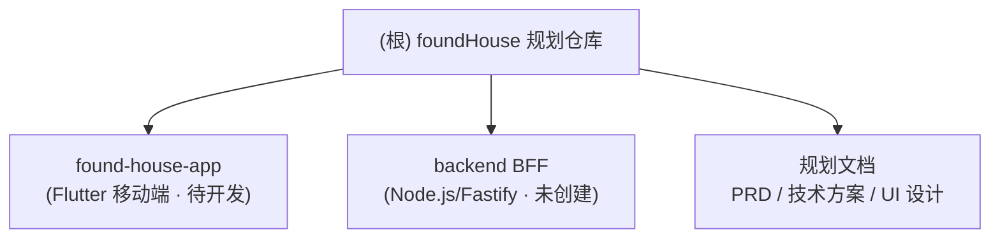

# foundHouse 扫楼找房助手

> **状态更新（2026-07）**：本文包含早期规划阶段和 map-first 方案描述，作为历史背景保留。当前迭代以 `租房扫楼产品PRDv1.1.md` 为准：扫楼 Tab 是首页/村列表，主流程为「新增村 → 进入村 → 新增楼栋/记录房源」，地图/定位/第三方地图 API 已从用户主流程下线。

## 项目愿景

面向个人租客的线下扫楼记录与房源决策工具。帮助用户在城中村、城郊结合部、老小区、公寓楼密集区域现场记录候选房源，并基于通勤、价格、房屋质量、周边环境和风险项筛选优质房源。

第一版定位：个人扫楼助手（不做房源平台、交易、合同签署、实时多人协作）。目标城市优先深圳/广州等城中村密集城市。

## 当前状态（重要）

本仓库目前处于「规划阶段」，尚无源代码。现有内容为三份中文产品与技术文档，`found-house-app/` 为已 `git init` 但无任何提交与源码的空仓库骨架。

- 规划文档：PRD、落地技术方案、移动端 UI 设计（均在根目录）。
- 待建模块：Flutter 移动端（`found-house-app/`）、Node.js/Fastify 后端 BFF（尚无目录）。

## 架构总览（规划中）

MVP 采用移动端本地优先应用，核心闭环为：扫楼前设偏好 → 现场快速记录 → 自动补全地图/通勤/周边 → 硬筛选 + 评分排序 → 对比导出。

规划技术栈：

| 层 | 选型 |
| --- | --- |
| 移动端 | Flutter + Riverpod + go_router |
| 本地数据 | SQLite + Drift，照片/录音存端侧文件系统 |
| 地图能力 | 高德地图 SDK + 高德 WebService（经后端代理） |
| 后端 | Node.js 22 + Fastify（BFF），PostgreSQL + Redis（可选） |
| 导出 | pdf + printing，端侧生成，默认脱敏 |

数据策略：离线本地优先，云同步作为 V1.1 显式开启能力。敏感字段（电话、微信、门牌）本地加密。

## 模块结构图

## 模块索引

| 模块 | 路径 | 职责 | 状态 |
| --- | --- | --- | --- |
| 移动端客户端 | `found-house-app/` | Flutter 扫楼记录、评分筛选、对比导出主应用 | 空仓库骨架，待开发 |
| 后端 BFF | 待创建 | 高德地图代理、配置下发、匿名统计、可选云同步 | 未创建目录 |

## 文档索引

| 文档 | 说明 |
| --- | --- |
| `租房扫楼产品PRD.md` | 产品需求：定位、用户、功能需求（P0/P1）、数据模型草案、成功指标、决策日志 |
| `租房扫楼产品落地细节与技术实现方案.md` | 技术架构、数据表结构、核心算法（月总成本/硬筛选/加权评分）、地图 API 设计、里程碑、测试策略 |
| `租房扫楼产品移动端UI设计文档.md` | 信息架构、视觉系统、核心页面设计、组件规范、动效规范、可访问性（历史规划；实现以 Kawaii 主题 + design-system 为准） |
| `design-system/foundhouse/MASTER.md` | **当前 UI 设计系统 Source of Truth**：Kawaii Minimal、语义色/间距/动效、Flutter 约束、交付清单 |
| `design-system/foundhouse/pages/` | 页面级覆盖：`scan-list` / `quick-record` / `house-detail` / `compare`（有则优先于 Master） |

## 运行与开发

当前无可运行代码。后续开发建议按里程碑推进：

- 第 0 周：原型与规则固化（信息架构、字段字典、Checklist 模板、评分规则 v0）
- 第 1-2 周：本地记录闭环（Flutter 工程 + SQLite/Drift schema + 房源 CRUD + 拍照 + Checklist）
- 第 3 周：地图与通勤（高德展示 + BFF 代理 + POI 统计 + 通勤时间）
- 第 4 周：评分筛选与对比（硬筛选引擎 + 加权评分 + 解释页 + 对比导出）
- 第 5 周：隐私、稳定性与内测

## 测试策略（规划）

- 单元测试：月总成本计算、硬筛选规则、加权评分、风险红线覆盖、缺失字段扣分、导出脱敏过滤。
- 集成测试：新建→拍照→checklist→保存→重启→数据仍在；地图 API 失败不阻断本地记录；权重变更后重算评分且保留历史快照。
- 现场测试：真机走查扫楼全流程。

## 编码规范（规划）

- `ScoreEngine`、`FilterEngine` 不依赖 UI，便于单元测试。
- `HouseRepository` 只负责读写，不含评分逻辑。
- 地图结果先落本地快照，列表与评分从本地快照读取。
- 照片操作统一走 `PhotoStore`，避免路径散落。
- 评分规则必须版本化（如 `mvp-2026-07-02`），变更保留旧快照。

## AI 使用指引

- 修改前先阅读对应模块 `CLAUDE.md` 与相关规划文档，确认字段字典、评分规则与隐私边界。
- **改 UI / 新建页面 / 调视觉时**：先读 `design-system/foundhouse/pages/<page>.md`（若存在），再读 `design-system/foundhouse/MASTER.md`；色板与组件以 `found-house-app/lib/app/theme.dart`、`kawaii_widgets.dart` 为准，页面规则覆盖 Master。
- 涉及隐私敏感数据（定位、联系人、照片、录音、门牌）时，遵循「本地优先、默认不上传、导出脱敏」原则。
- 风险提示只做建议，不做法律结论。

## 实测环境约束（2026-07-03 落地验证）

本机网络策略拦截 pub.dev / npm 官方源，依赖必须走国内镜像，已固化：

- **Flutter/Dart**：3.44.4 / 3.12.2（stable）。
- **pub**：`PUB_HOSTED_URL=https://pub.flutter-io.cn` 已写入用户环境变量；新开的 bash 会话若未继承，命令需内联 `export PUB_HOSTED_URL=https://pub.flutter-io.cn`。`flutter analyze` 会隐式触发 pub get，同样需要镜像变量。
- **npm**：registry 已设为 `https://registry.npmmirror.com`（BFF 用）。
- **版本锁定（pub 实际解析，与 pubspec 原注释不符，以 lock 为准）**：`flutter_riverpod` 锁定在 **2.6.1（2.x 经典 API，非 3.x）**，`go_router` **17.x**，`sqlite3_flutter_libs 0.6.0+eol`，`flutter_secure_storage 10.x`。**新增 Riverpod 代码一律用 2.x API 风格**（与现有 `router.dart` 一致），勿用 3.x 的 `Ref`/codegen 写法。
- **Drift 代码生成**：`tables.dart` 的 `library;` 指令必须在所有 import 之前；`build.yaml` 不再需要 `generate_connect_constructor`（drift 2.5+ 已废弃）。生成命令 `dart run build_runner build --delete-conflicting-outputs`。
- **平台工程**：`found-house-app/` 尚无 `android/ios/` 目录，真机运行前需 `flutter create --project-name found_house_app --org <org> .` 补齐（不覆盖已有 lib/pubspec）。

## 变更记录 (Changelog)

- 2026-07-11：文档索引与 AI 指引加入 `design-system/foundhouse/`（ui-ux-pro-max 生成并按 PRD/Kawaii 实现校正）。
- 2026-07-03：进入编码执行阶段。修复 Drift `tables.dart` 的 `library;` 指令位置与废弃 build 选项，跑通 build_runner 代码生成，`flutter analyze` 0 error/0 warning。固化镜像与版本锁定约束。启动引擎轨/仓库轨/BFF 轨并行开发。
- 2026-07-02：首次生成文档。识别为规划阶段仓库（3 份文档 + 空 Flutter 仓库骨架），建立根级与移动端模块 CLAUDE.md。
